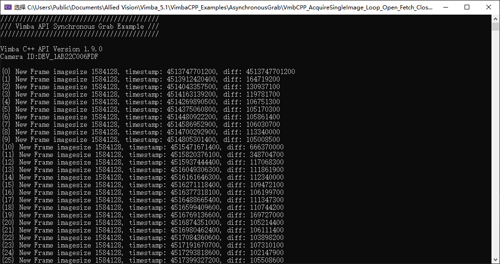

# VmbCPP_AcquireSingleImage_Loop_Open_Fetch_Close
Refine C:\Users\Public\Documents\Allied Vision\Vimba_5.1\VimbaCPP_Examples\SynchronousGrab\Console example and fetch images in 10000 loop.

## Modifications
*Original AcquireSingleImage*

```c++
// Original example code with Open/Acquire/Close in ONE function, 
// NOT to use it directly for sake of efficiency!!!
err = apiController.AcquireSingleImage( strCameraID, pFrame );
```

*Refined AcquireSingleImage*

```c++
err = apiController.InitCamera(strCameraID);

for(int i = 0; i < 100000; i++)
{
    err = apiController.FetchOneImage(pFrame);
    
    // TODO: to save frame into bitmap or process with Halcon/OpenCV, etc.
    // ...
    // ...
    // ...
    // ...
}

err = apiController.CloseCamera(); 
```

## Screenshots



## Complication
Put this code folder as below in Vimba CPP examples folder:
```
C:\Users\Public\Documents\Allied Vision\Vimba_5.1\VimbaCPP_Examples\AsynchronousGrab\VmbCPP_AcquireSingleImage_Loop_Open_Fetch_Close\Build\VS2010
```
You may use Vimba 4.0, Vimba 6.0 or higher and replace above 5.1 with 4.0 or 6.0, etc,.
